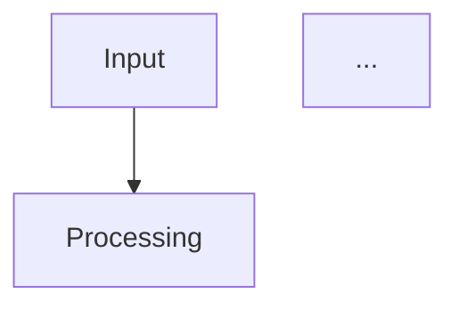
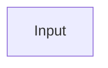

# System Architecture Diagrams - Usage Guide

This directory contains all 10 publication-quality diagrams for the neuro-symbolic AI academic paper on temporal reasoning.

## Directory Contents

```
diagrams/
├── diagram1.mmd          - Overall System Architecture
├── diagram2.mmd          - Temporal Reasoning Architecture
├── diagram3.mmd          - Multi-DSL Fine-Tuning Pipeline
├── diagram4.mmd          - Provenance-Guided DSL Generation
├── diagram5.mmd          - Uncertainty-Aware Verification Framework
├── diagram6.mmd          - Temporal Provenance Example (Healthcare Case Study)
├── diagram7.mmd          - Multi-Domain Performance Comparison
├── diagram8.mmd          - User Study Results (Provenance Quality)
├── diagram9.mmd          - Dataset Construction Pipeline
├── diagram10.mmd         - Ablation Study Results
├── all_diagrams.md       - All diagrams in one markdown file with descriptions
└── README.md             - This file
```

## File Formats

- **`.mmd` files**: Pure Mermaid syntax (can be rendered by Mermaid tools)
- **`all_diagrams.md`**: Markdown file with all diagrams embedded in ```mermaid code blocks

## How to Render Diagrams

### Method 1: Mermaid Live Editor (Online)

1. Visit: https://mermaid.live/
2. Copy contents of any `.mmd` file
3. Paste into the editor
4. Export as PNG, SVG, or PDF

**Advantages**: No installation required, immediate preview, multiple export formats

### Method 2: VS Code with Mermaid Extension

1. Install VS Code extension: "Markdown Preview Mermaid Support" or "Mermaid Editor"
2. Open any `.mmd` file or `all_diagrams.md`
3. Use preview pane to view rendered diagrams
4. Export/screenshot as needed

**Advantages**: Works offline, integrated with development environment

### Method 3: Command Line with Mermaid CLI

```bash
# Install mermaid-cli (requires Node.js)
npm install -g @mermaid-js/mermaid-cli

# Render a single diagram to PNG
mmdc -i diagram1.mmd -o diagram1.png

# Render to SVG (better for publications)
mmdc -i diagram1.mmd -o diagram1.svg

# Render all diagrams at once
for file in diagram*.mmd; do
    mmdc -i "$file" -o "${file%.mmd}.png"
done

# For high-resolution publication quality (300 DPI)
mmdc -i diagram1.mmd -o diagram1.png -w 2400 -H 1800
```

**Advantages**: Batch processing, scriptable, high-resolution output

### Method 4: GitHub/GitLab Markdown Preview

1. Upload `all_diagrams.md` to GitHub or GitLab
2. View the file in the web interface
3. Both platforms render Mermaid diagrams automatically

**Advantages**: No tools needed, shareable links, version control

### Method 5: Markdown Preview Enhanced (Atom/VS Code)

1. Install "Markdown Preview Enhanced" extension
2. Open `all_diagrams.md`
3. Use Ctrl+Shift+M (Windows) or Cmd+Shift+M (Mac) for preview
4. Right-click preview → Export as PDF/PNG/HTML

**Advantages**: Multiple export formats, embedded in workflow

### Method 6: Pandoc for LaTeX/PDF

```bash
# Install pandoc with mermaid filter
pip install pandoc-mermaid-filter

# Convert to LaTeX
pandoc all_diagrams.md -o diagrams.tex --filter pandoc-mermaid-filter

# Convert directly to PDF
pandoc all_diagrams.md -o diagrams.pdf --filter pandoc-mermaid-filter
```

**Advantages**: Direct integration with academic paper workflow

## Embedding in Academic Papers

### For LaTeX Papers

```latex
% Option 1: Include as images (after rendering to PNG/SVG)
\begin{figure}[h]
    \centering
    \includegraphics[width=0.9\textwidth]{diagrams/diagram1.png}
    \caption{Overall System Architecture}
    \label{fig:system-architecture}
\end{figure}

% Option 2: Use mermaid package (requires lualatex)
\usepackage{mermaid}
\begin{mermaid}
    % Copy contents of diagram1.mmd here
\end{mermaid}
```

### For Word/Google Docs

1. Render diagram to PNG using Mermaid Live Editor or CLI
2. Insert image into document
3. Set appropriate size (typically 6-7 inches width for full-page figures)

### For Markdown-based Papers (Pandoc)

```markdown
# System Architecture

{width=90%}
```

Or embed directly:

````markdown

````

## Customization

### Adjusting Colors

Mermaid diagrams use CSS-style color codes. To modify:

```mermaid
style A fill:#YOUR_COLOR,stroke:#333,stroke-width:2px
```

Common color schemes used:
- **Input/Output**: `#ADD8E6` (light blue)
- **Neural/LLM**: `#FFA500` (orange)
- **Symbolic**: `#9370DB` (medium purple)
- **Provenance**: `#20B2AA` (light sea green)
- **Error/Abstention**: `#FF6B6B` (light red)
- **Success**: `#90EE90` (light green)

### Adjusting Layout

For flowcharts, you can change direction:
- `flowchart TD` - Top to Down (vertical)
- `flowchart LR` - Left to Right (horizontal)
- `flowchart BT` - Bottom to Top
- `flowchart RL` - Right to Left

### Adjusting Size/Resolution

For high-resolution output (publications):

```bash
# Mermaid CLI with custom dimensions
mmdc -i diagram1.mmd -o diagram1.png -w 3000 -H 2250

# Or set background color for transparency
mmdc -i diagram1.mmd -o diagram1.png -b transparent
```

## Publication Quality Guidelines

### For Print Publications

1. **Format**: Export as SVG or high-resolution PNG (300 DPI minimum)
2. **Size**: Typically 6-7 inches width for full-column figures
3. **Colors**: Use black/white friendly colors (current palette is optimized)
4. **Font Size**: Ensure text is readable at print size (12pt minimum)

### For Digital/Web Publications

1. **Format**: SVG preferred (scalable, smaller file size)
2. **Size**: Responsive sizing (width: 90-100%)
3. **Colors**: Use accessible color contrasts (current palette meets WCAG AA)

### Accessibility Considerations

All diagrams follow accessibility best practices:
- High contrast colors (4.5:1 minimum ratio)
- Clear text labels (no color-only information)
- Alternative text descriptions available in `all_diagrams.md`
- Patterns/shapes in addition to colors for differentiation

## Troubleshooting

### Diagram Not Rendering

**Issue**: Mermaid code not displaying correctly

**Solutions**:
1. Check syntax errors (missing semicolons, brackets)
2. Ensure proper indentation
3. Try rendering in Mermaid Live Editor first
4. Update Mermaid CLI/extension to latest version

### Text Overlapping

**Issue**: Labels overlapping in complex diagrams

**Solutions**:
1. Use `<br/>` for line breaks in labels
2. Increase node spacing (add intermediate nodes)
3. Adjust layout direction (TD vs LR)
4. Shorten label text

### Export Quality Issues

**Issue**: Low-resolution or blurry exports

**Solutions**:
1. Use SVG format instead of PNG
2. Increase dimensions: `mmdc -w 3000 -H 2250`
3. Set scale factor: `mmdc -s 2`
4. Use vector graphics editor (Inkscape) for post-processing

### Colors Not Displaying

**Issue**: Custom colors not showing

**Solutions**:
1. Ensure hex codes are correct (`#RRGGBB` format)
2. Check CSS syntax: `fill:#COLOR,stroke:#COLOR`
3. Some renderers require `%%init%%` configuration block

## Advanced Features

### Theming

Create custom theme file `theme.json`:

```json
{
  "theme": "base",
  "themeVariables": {
    "primaryColor": "#ADD8E6",
    "primaryTextColor": "#000",
    "primaryBorderColor": "#333",
    "lineColor": "#666",
    "fontSize": "16px"
  }
}
```

Apply theme:

```bash
mmdc -i diagram1.mmd -o diagram1.png -t theme.json
```

### Interactive Diagrams

For web-based papers, add clickable links:



## Diagram Descriptions for Paper

### Figure Numbers and Captions

Recommended placement in paper:

1. **Figure 1**: Overall System Architecture (Section 2: Methodology)
2. **Figure 2**: Temporal Reasoning Architecture (Section 3: Temporal Module)
3. **Figure 3**: Temporal Provenance Example (Section 4: Case Study)
4. **Figure 4**: Multi-Domain Performance Comparison (Section 5: Results)
5. **Figure 5**: User Study Results (Section 5: Results)
6. **Figure 6**: Provenance-Guided DSL Generation (Appendix A)
7. **Figure 7**: Uncertainty-Aware Verification Framework (Appendix B)
8. **Figure 8**: Multi-DSL Fine-Tuning Pipeline (Appendix C)
9. **Figure 9**: Dataset Construction Pipeline (Appendix D)
10. **Figure 10**: Ablation Study Results (Appendix E)

### Sample Caption Templates

```latex
\caption{Overall neuro-symbolic hybrid system architecture showing the complete
information flow from natural language input through LLM semantic parsing,
uncertainty quantification, DSL generation, symbolic reasoning with temporal
module, provenance tracking, and verification. Colored components indicate:
blue (input/output), orange (neural), purple (symbolic), teal (provenance),
red (error handling). Dashed arrows show feedback loops for iterative refinement.}
```

## Version History

- **v1.0** (2025-10-15): Initial creation of all 10 diagrams
  - Complete system architecture diagrams
  - Temporal reasoning visualizations
  - Performance and evaluation charts
  - Methodology pipelines

## Contact & Support

For questions about diagram rendering or customization:
1. Mermaid Documentation: https://mermaid.js.org/
2. Mermaid Live Editor: https://mermaid.live/
3. GitHub Issues: https://github.com/mermaid-js/mermaid/issues

## License

These diagrams are part of the academic paper on neuro-symbolic temporal reasoning.
Please cite the paper when using these diagrams in derivative works.

---

## Quick Start Checklist

- [ ] Install Mermaid CLI or VS Code extension
- [ ] Test rendering with `diagram1.mmd`
- [ ] Export all diagrams to PNG/SVG for paper
- [ ] Verify accessibility (contrast, text size)
- [ ] Add figure captions in LaTeX/Word document
- [ ] Check rendering at final paper dimensions
- [ ] Review with co-authors for clarity
- [ ] Submit with paper manuscript

## Recommended Workflow

```bash
# 1. Navigate to diagrams directory
cd ./diagrams/

# 2. Preview in VS Code or Mermaid Live Editor
# (Open all_diagrams.md)

# 3. Export all diagrams to high-res PNG
for file in diagram*.mmd; do
    mmdc -i "$file" -o "${file%.mmd}.png" -w 2400 -H 1800 -b white
done

# 4. Also export to SVG for vector graphics
for file in diagram*.mmd; do
    mmdc -i "$file" -o "${file%.mmd}.svg"
done

# 5. Insert into LaTeX paper
# Copy PNG/SVG files to paper's figures/ directory
# Reference in LaTeX: \includegraphics{figures/diagram1.png}
```

---

**Happy Diagramming!** 📊📈📉
