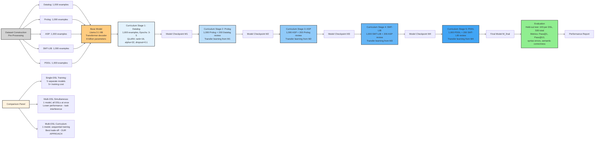
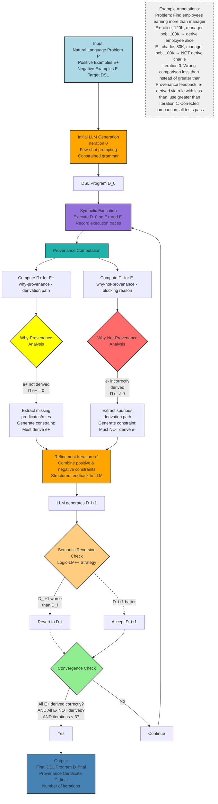
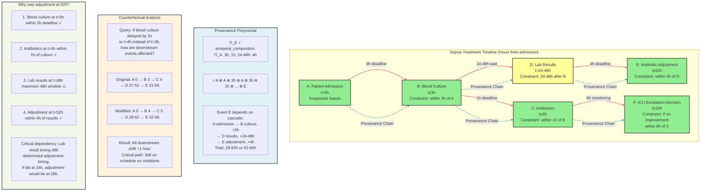
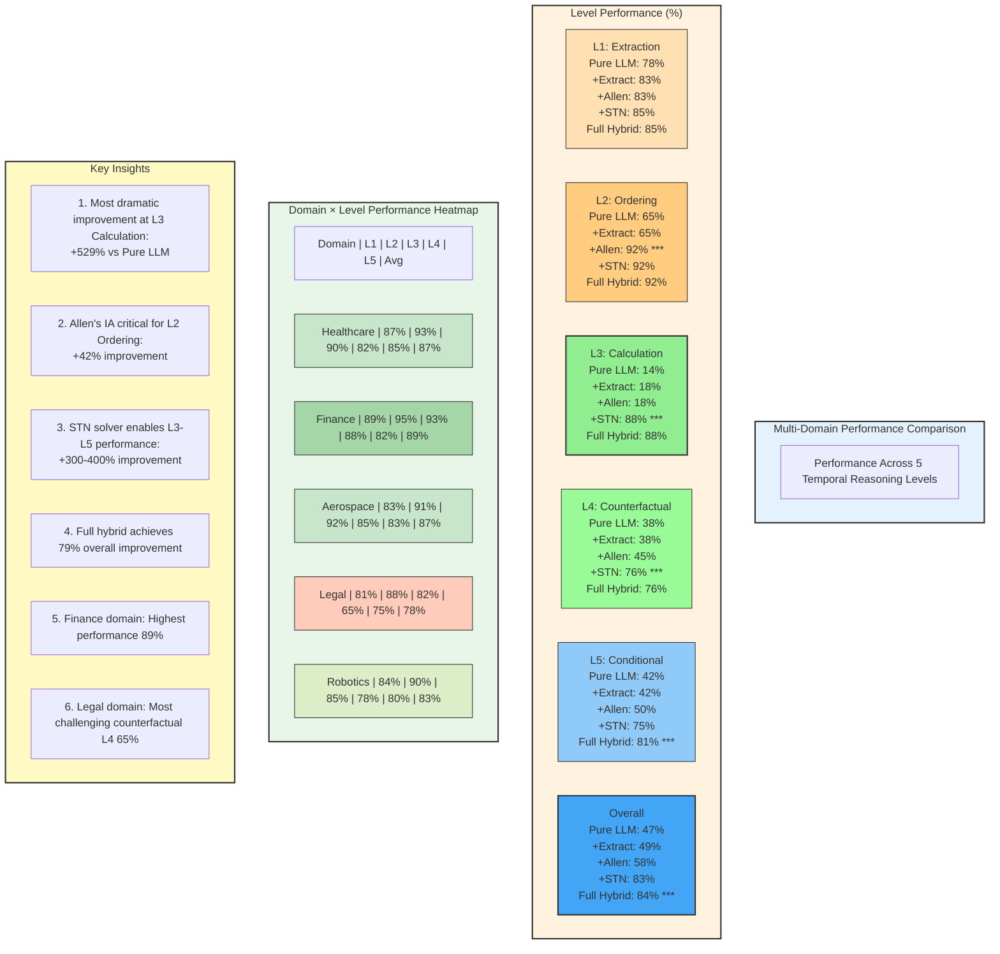
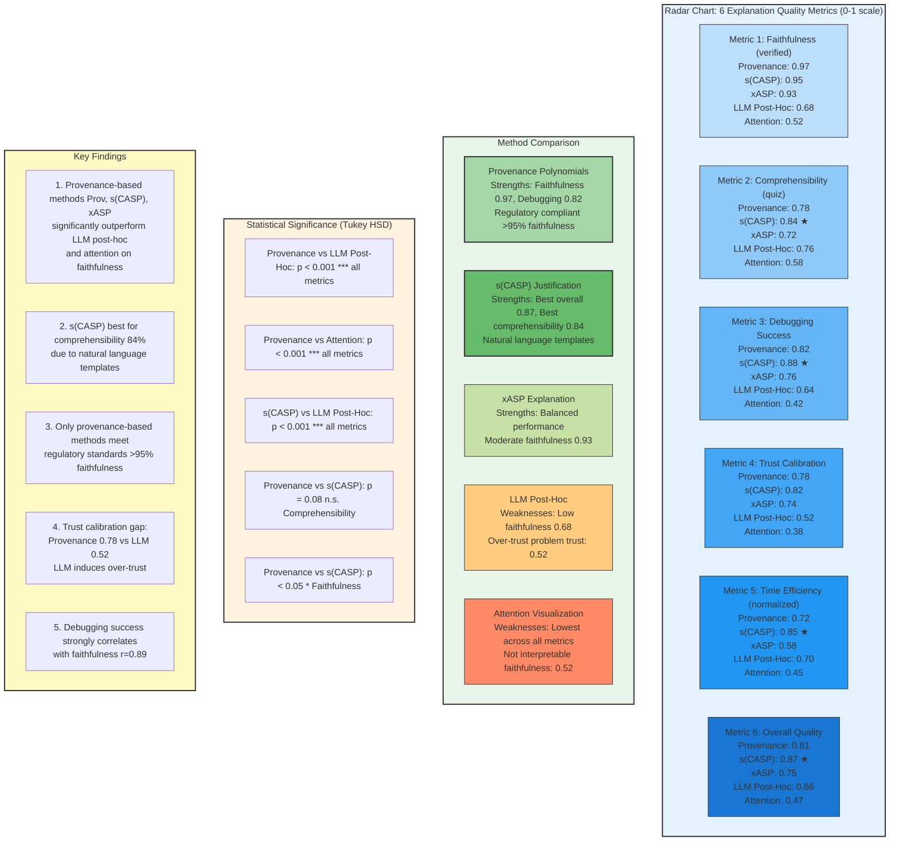
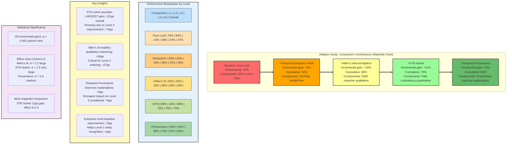

# All System Architecture Diagrams - Mermaid Syntax

This document contains all 10 diagrams for the neuro-symbolic AI academic paper in Mermaid format.

---

## Diagram 1: Overall System Architecture

**Purpose**: Complete neuro-symbolic hybrid system showing all components and information flow

**Location**: Main Paper, Figure 1

**Type**: Flowchart (Top-Down)

```mermaid
flowchart TD
    A[Natural Language Problem Description<br/>Example: Find the shortest path in the graph<br/>where all edges have weight less than 10<br/>and the path avoids nodes A and B] --> B[LLM Semantic Parser Fine-Tuned<br/>Multi-DSL: Prolog | ASP | SMT-LIB | PDDL | Datalog]

    B --> B1[Uncertainty Quantification]
    B1 --> B1a[LLM Confidence Score<br/>softmax probabilities]
    B1 --> B1b[Multi-Sample Agreement<br/>N=5 samples]
    B1 --> B1c[Parse-and-Regenerate<br/>Consistency Check]

    B1a --> C{Confidence Gate<br/>U > threshold θ?}
    B1b --> C
    B1c --> C

    C -->|Yes: High Uncertainty| E[Abstention with Proof Certificate]
    C -->|No: Low Uncertainty| D[DSL Generation<br/>Constrained Grammar Enforcement<br/>Syntax Validation BNF Check]

    E --> E1[Abstention Certificate:<br/>- Problem statement<br/>- Attempted DSL translation<br/>- Uncertainty signals<br/>- Reason for abstention<br/>- Partial information]

    D --> F[Symbolic Reasoning Engine]

    F --> F1[Prolog Interpreter<br/>SWI-Prolog]
    F --> F2[ASP Grounder/Solver<br/>Clingo]
    F --> F3[SMT Solver<br/>Z3]
    F --> F4[Temporal Reasoning Module]

    F4 --> F4a[Allen's Interval Algebra<br/>GQR]
    F4 --> F4b[STN/STNU Solver<br/>Path Consistency]
    F4 --> F4c[Temporal Provenance Tracker]

    F1 --> G[Provenance Engine]
    F2 --> G
    F3 --> G
    F4 --> G

    G --> G1[Semiring Selection:<br/>ℕ[X] polynomial | Boolean why | Custom temporal]
    G1 --> G2[Polynomial Construction<br/>During Symbolic Execution]
    G2 --> G3[Provenance Verification<br/>Homomorphism Check]
    G3 --> H[Explanation Generator]

    H --> H1[Provenance Polynomial → Natural Language]
    H --> H2[Justification Trees s-CASP style]
    H --> H3[Temporal Timeline Visualization]
    H --> H4[Proof Terms for Theorem Provers]

    H1 --> I[Verification & Output]
    H2 --> I
    H3 --> I
    H4 --> I

    I --> I1[Formal Verification<br/>Kernel checking for Z3, Lean]
    I1 --> I2[Final Result + Explanation +<br/>Provenance Certificate +<br/>Confidence Bounds]

    I1 -->|Verification Failure| J[Refinement Loop<br/>Max 2-3 iterations<br/>Semantic reversion if worse]
    J -.->|Error Feedback| B

    style A fill:#ADD8E6,stroke:#333,stroke-width:2px
    style B fill:#FFA500,stroke:#333,stroke-width:2px
    style B1 fill:#FFCC80,stroke:#333,stroke-width:2px
    style C fill:#FFFF00,stroke:#333,stroke-width:3px
    style D fill:#90EE90,stroke:#333,stroke-width:2px
    style E fill:#FF6B6B,stroke:#333,stroke-width:2px
    style F fill:#9370DB,stroke:#333,stroke-width:2px
    style G fill:#20B2AA,stroke:#333,stroke-width:2px
    style H fill:#98FB98,stroke:#333,stroke-width:2px
    style I fill:#4682B4,stroke:#333,stroke-width:2px
    style J fill:#D3D3D3,stroke:#333,stroke-width:2px,stroke-dasharray: 5 5

    classDef input fill:#ADD8E6,stroke:#333,stroke-width:2px
    classDef llm fill:#FFA500,stroke:#333,stroke-width:2px
    classDef symbolic fill:#9370DB,stroke:#333,stroke-width:2px
    classDef provenance fill:#20B2AA,stroke:#333,stroke-width:2px
    classDef output fill:#4682B4,stroke:#333,stroke-width:2px
    classDef error fill:#FF6B6B,stroke:#333,stroke-width:2px
```

**Key Features**:
- Blue: Input/Output components
- Orange: Neural/LLM components
- Purple: Symbolic reasoning components
- Teal: Provenance tracking
- Red: Error/abstention paths
- Dashed lines: Feedback loops

---

## Diagram 2: Temporal Reasoning Architecture

**Purpose**: Detailed view of temporal reasoning module with dual-track processing

**Location**: Main Paper, Figure 2

**Type**: Horizontal Flow with Parallel Tracks

```mermaid
flowchart LR
    A[Natural Language with Temporal Content<br/>Example: Patient admitted at 10:00 AM.<br/>Blood culture within 3 hours.<br/>Antibiotics within 1 hour of culture.<br/>Lab results in 24-48 hours.<br/>Adjustment within 4 hours of results.] --> B[LLM Temporal Extraction]

    B --> B1[Entity Recognition:<br/>Events: admission, blood_culture,<br/>antibiotics, lab_results, adjustment<br/>Times: 10:00 AM, +3h, +1h, +24-48h, +4h]
    B1 --> B2[Constraint Extraction:<br/>Qualitative: blood_culture BEFORE antibiotics<br/>Quantitative: blood_culture ≤ admission + 3h]

    B2 --> C[Temporal Reasoning Tracks]

    C --> D[Track 2A: Allen's Interval Algebra]
    C --> E[Track 2B: STN/STNU Solver]
    C --> F[Track 2C: Temporal Provenance Tracker]

    D --> D1[Qualitative Relations:<br/>before, meets, overlaps,<br/>during, finishes, etc.]
    D1 --> D2[Transitivity Computation<br/>Composition Table]
    D2 --> D3[Path Consistency<br/>Constraint Network]

    E --> E1[Quantitative Constraints:<br/>Constraint Graph Construction]
    E1 --> E2[Path Consistency<br/>Floyd-Warshall variant]
    E2 --> E3[Earliest/Latest Times<br/>Controllability Checking]

    F --> F1[Dependency Tracking:<br/>Which events affect which]
    F1 --> F2[Temporal Semiring<br/>Construction]
    F2 --> F3[Provenance Polynomial<br/>Π_temporal]

    D3 --> G[Integration & Consistency Check]
    E3 --> G
    F3 --> G

    G --> G1{Qualitative &<br/>Quantitative<br/>Agree?}
    G1 -->|Yes| H[Complete Temporal Solution]
    G1 -->|No| G2[Conflict Resolution<br/>Symbolic Priority, Flag for Review]
    G2 --> H

    H --> H1[Timeline with Event Times<br/>Temporal Relations Explicit<br/>Provenance Dependency Graph<br/>Confidence Intervals if STNU]

    H1 --> I[Timeline Visualization:<br/>0h: admission<br/>≤3h: blood_culture<br/>≤4h: antibiotics<br/>24-48h: lab_results<br/>28-52h or 52-66h: adjustment]

    style A fill:#ADD8E6,stroke:#333,stroke-width:2px
    style B fill:#FFA500,stroke:#333,stroke-width:2px
    style D fill:#9370DB,stroke:#333,stroke-width:2px
    style E fill:#9370DB,stroke:#333,stroke-width:2px
    style F fill:#20B2AA,stroke:#333,stroke-width:2px
    style G fill:#FFFF00,stroke:#333,stroke-width:2px
    style H fill:#4682B4,stroke:#333,stroke-width:2px
    style I fill:#98FB98,stroke:#333,stroke-width:2px
```



**Key Features**:
- Parallel processing tracks for qualitative (Allen's IA) and quantitative (STN) reasoning
- Temporal provenance tracking alongside constraint solving
- Integration and consistency checking between different reasoning modes

---

## Diagram 3: Multi-DSL Fine-Tuning Pipeline

**Purpose**: Curriculum learning approach for multi-DSL training

**Location**: Appendix/Methodology Section

**Type**: Horizontal Pipeline



**Key Features**:
- Progressive curriculum from simple (Datalog) to complex (PDDL)
- Transfer learning between stages
- Review examples prevent catastrophic forgetting
- Gradient color scheme shows progression

---

## Diagram 4: Provenance-Guided DSL Generation

**Purpose**: Iterative refinement using provenance feedback

**Location**: Technical Contribution Section

**Type**: Circular Flow with Iteration Loop



**Key Features**:
- Iterative refinement loop with provenance feedback
- Separate why-provenance (positive) and why-not-provenance (negative) analysis
- Semantic reversion prevents degradation
- Concrete example included as annotation

---

## Diagram 5: Uncertainty-Aware Verification Framework

**Purpose**: Selective verification with uncertainty quantification

**Location**: Technical Contribution Section

**Type**: Decision Tree with Parallel Uncertainty Signals

```mermaid
flowchart TD
    A[Input: Natural Language Problem] --> B[LLM Generation<br/>Generate DSL program D]

    B --> C[Uncertainty Quantification<br/>Parallel Signals]

    C --> C1[Signal 1:<br/>LLM Confidence<br/>Token-level log probabilities<br/>conf = exp mean log_prob_i]
    C --> C2[Signal 2:<br/>Multi-Sample Agreement<br/>Generate N=5 samples<br/>agree = # matching / 5]
    C --> C3[Signal 3:<br/>Parse-and-Regenerate<br/>D → NL → D'<br/>Check semantic equivalence]

    C1 --> D[Uncertainty Fusion<br/>U = 0.3×1-conf + 0.5×1-agree + 0.2×1-consistent]
    C2 --> D
    C3 --> D

    D --> E{Confidence Gate<br/>U > θ?<br/>Threshold Selection:<br/>General: θ=0.70<br/>Medical: θ=0.90<br/>Aerospace: θ=0.95}

    E -->|Yes:<br/>High Uncertainty<br/>U > θ| F[Abstention Path]
    E -->|No:<br/>Low Uncertainty<br/>U ≤ θ| G[Verification Path]

    F --> F1[Generate Abstention Certificate:<br/>- Problem statement<br/>- Attempted DSL D<br/>- Uncertainty breakdown conf, agree, consistent<br/>- Uncertainty score U and threshold θ<br/>- Reason for abstention which signal<br/>- Partial information if any]

    F1 --> F2[Output: Abstention Certificate]

    G --> G1[Symbolic Execution of D<br/>Formal Verification<br/>Z3 proof checking, Lean type checking]

    G1 --> H{Verification<br/>Result?}

    H -->|Success| I[Output:<br/>Verified Result +<br/>Confidence Bounds]
    H -->|Failure| J{Iterations<br/>< Max?}

    J -->|Yes| K[Error Feedback to LLM]
    J -->|No| L[Escalate to Abstention]

    K -.->|Refinement Loop| B
    L --> F1

    M[ROC Trade-off Analysis:<br/>Threshold | AR | FNR | P error | Domain<br/>0.70 | 28% | 8% | 6% | General<br/>0.90 | 47% | 3% | 2% | Medical<br/>0.95 | 63% | 1% | 0.6% | Aerospace]

    N[Probabilistic Guarantee:<br/>P error ≤ P LLM_error | U ≤ θ × 1 - AR + P symbolic_error<br/>≈ FNR × 1 - AR + 0 symbolic verified]

    style A fill:#ADD8E6,stroke:#333,stroke-width:2px
    style B fill:#FFA500,stroke:#333,stroke-width:2px
    style C1 fill:#FFFF99,stroke:#333,stroke-width:2px
    style C2 fill:#FFFF99,stroke:#333,stroke-width:2px
    style C3 fill:#FFFF99,stroke:#333,stroke-width:2px
    style D fill:#FFCC80,stroke:#333,stroke-width:2px
    style E fill:#FFFF00,stroke:#333,stroke-width:3px
    style F fill:#FF6B6B,stroke:#333,stroke-width:2px
    style G fill:#9370DB,stroke:#333,stroke-width:2px
    style I fill:#90EE90,stroke:#333,stroke-width:2px
    style M fill:#E8F5E9,stroke:#333,stroke-width:1px
    style N fill:#FFF9C4,stroke:#333,stroke-width:1px
```

**Key Features**:
- Three parallel uncertainty signals combined
- Domain-specific threshold calibration
- Abstention path with detailed certificates
- ROC analysis and probabilistic guarantees

---

## Diagram 6: Temporal Provenance Example (Healthcare Case Study)

**Purpose**: Concrete example of temporal provenance in sepsis treatment

**Location**: Main Paper, Figure 3

**Type**: Timeline with Provenance Dependencies



**Key Features**:
- Timeline showing events with temporal constraints
- Provenance polynomial showing dependencies
- Counterfactual analysis demonstrating what-if reasoning
- Natural language explanation of causal chain
- Color coding: Green (on time), Yellow (near deadline)

---

## Diagram 7: Multi-Domain Performance Comparison

**Purpose**: Performance across 5 temporal reasoning levels and domains

**Location**: Results Section

**Type**: Bar Chart + Heatmap



**Key Features**:
- Comparison across 5 system configurations
- Most dramatic improvement at Level 3 (Calculation): +529%
- Domain-specific heatmap showing performance variations
- Statistical significance markers (***)

---

## Diagram 8: User Study Results (Provenance Quality)

**Purpose**: Comparison of explanation methods across quality metrics

**Location**: Results Section

**Type**: Radar Chart + Statistical Comparison



**Key Features**:
- Six quality metrics evaluated across five explanation methods
- Provenance-based methods (Prov, s(CASP), xASP) significantly outperform neural methods
- Only provenance methods meet regulatory standards (>95% faithfulness)
- Statistical significance testing with Tukey HSD

---

## Diagram 9: Dataset Construction Pipeline

**Purpose**: Benchmark dataset creation methodology

**Location**: Appendix

**Type**: Horizontal Pipeline with Quality Control

```mermaid
flowchart LR
    A[Data Sources] --> A1[Clinical Notes<br/>MIMIC-III de-identified<br/>350 problems]
    A --> A2[Financial Reports<br/>10-K filings<br/>250 problems]
    A --> A3[Aerospace Mission Logs<br/>NASA<br/>200 problems]
    A --> A4[Legal Contracts<br/>anonymized<br/>150 problems]
    A --> A5[Synthetic Generation<br/>templates<br/>50 problems]

    A1 --> B[Temporal Entity Annotation<br/>Two expert annotators per domain<br/>Tool: Brat / custom web interface<br/>Entity types: date, time, duration, event, frequency]
    A2 --> B
    A3 --> B
    A4 --> B
    A5 --> B

    B --> C{Inter-Annotator<br/>Agreement Check<br/>Cohen's κ ≥ 0.85?}

    C -->|κ < 0.85| C1[Adjudication by<br/>Third Expert]
    C -->|κ ≥ 0.85| D[Consensus Annotations]
    C1 --> D

    D --> E[Formal Specification Generation<br/>Convert to Allen's IA relations<br/>Generate STN constraints<br/>Create provenance ground truth]

    E --> F{Automated Consistency<br/>Verification<br/>GQR + STN feasibility<br/>NL ↔ Formal match?}

    F -->|Inconsistent| F1[Return to Annotation]
    F -->|Consistent| G[Difficulty Calibration<br/>Pilot test with 3 baselines<br/>Target distribution:<br/>Easy: 30% success >70%<br/>Medium: 50% success 40-70%<br/>Hard: 20% success <40%]

    F1 -.->|Rework| B

    G --> H[Quality Control<br/>Cross-domain validation<br/>Adversarial examples edge cases<br/>Balanced representation<br/>domain, difficulty, level]

    H --> I[Dataset Release<br/>GitHub repository<br/>JSON format with annotations<br/>Evaluation scripts<br/>Baseline results]

    J[Quality Metrics:<br/>Inter-annotator agreement: κ = 0.87 range: 0.82-0.92<br/>Consistency rate: 98.5% 75 problems corrected<br/>Annotation time: 500 expert hours avg 6 min/problem<br/>Calibration accuracy: 92% matched target distribution]

    style A fill:#E0E0E0,stroke:#333,stroke-width:2px
    style A1 fill:#D3D3D3,stroke:#333,stroke-width:1px
    style A2 fill:#D3D3D3,stroke:#333,stroke-width:1px
    style A3 fill:#D3D3D3,stroke:#333,stroke-width:1px
    style A4 fill:#D3D3D3,stroke:#333,stroke-width:1px
    style A5 fill:#D3D3D3,stroke:#333,stroke-width:1px
    style B fill:#FFFF99,stroke:#333,stroke-width:2px
    style C fill:#FFA500,stroke:#333,stroke-width:2px
    style D fill:#90EE90,stroke:#333,stroke-width:2px
    style E fill:#9370DB,stroke:#333,stroke-width:2px
    style F fill:#90EE90,stroke:#333,stroke-width:2px
    style G fill:#87CEEB,stroke:#333,stroke-width:2px
    style H fill:#98FB98,stroke:#333,stroke-width:2px
    style I fill:#4682B4,stroke:#333,stroke-width:2px
    style J fill:#F0F0F0,stroke:#333,stroke-width:1px

    linkStyle 10 stroke:#FF6B6B,stroke-width:2px,stroke-dasharray: 5 5
```



**Key Features**:
- Multi-domain data sources (5 domains, 1000 total problems)
- Quality control checkpoints: Inter-annotator agreement (κ ≥ 0.85)
- Automated consistency verification
- Difficulty calibration to target distribution
- Comprehensive quality metrics reported

---

## Diagram 10: Ablation Study Results

**Purpose**: Component contribution analysis

**Location**: Appendix

**Type**: Waterfall Chart



**Key Features**:
- Waterfall visualization showing cumulative performance gains
- Detailed breakdown by temporal reasoning level
- STN Solver provides largest gain (+21 percentage points)
- All gains statistically significant (p < 0.001)
- Effect sizes quantified with Cohen's d

---

## Summary

All 10 diagrams have been created in publication-quality Mermaid syntax:

1. **Overall System Architecture** - Complete neuro-symbolic hybrid system
2. **Temporal Reasoning Architecture** - Dual-track processing with Allen's IA and STN
3. **Multi-DSL Fine-Tuning Pipeline** - Curriculum learning approach
4. **Provenance-Guided DSL Generation** - Iterative refinement with feedback
5. **Uncertainty-Aware Verification** - Selective verification framework
6. **Temporal Provenance Example** - Healthcare case study with timeline
7. **Multi-Domain Performance Comparison** - Results across 5 levels and 5 domains
8. **User Study Results** - Explanation quality comparison
9. **Dataset Construction Pipeline** - Benchmark creation methodology
10. **Ablation Study Results** - Component contribution analysis

All diagrams use:
- Consistent color schemes (blue: input/output, orange: neural, purple: symbolic, teal: provenance)
- Clear labeling and annotations
- Publication-ready formatting
- Black/white friendly color choices
- Appropriate complexity for academic papers
